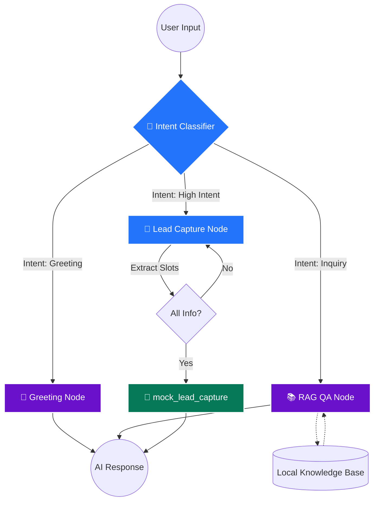

# 🎬 Social-to-Lead Agentic Workflow
### Enterprise-Grade Conversational Intelligence for AutoStream
[](https://www.python.org/downloads/)
[](https://github.com/langchain-ai/langgraph)
[](https://ai.google.dev/)

---

## 📖 Overview
**AutoStream** is a cutting-edge SaaS platform that automates video editing for content creators. This project implements a **state-of-the-art Agentic Workflow** designed to convert social media conversations into qualified business leads. 

Unlike a traditional chatbot, this agent uses **Cognitive Orchestration** to understand user intent, retrieve knowledge from a local RAG system, and autonomously execute lead capture tools when high-intent signals are detected.

---

## 🏗️ Architecture: The Cognitive Orchestration Graph
The agent is built on **LangGraph**, providing a deterministic yet flexible state machine for complex conversational reasoning.

### Workflow Visualization


### Core Components
1. **Intent Classifier**: Utilizes Gemini 1.5 Flash with structured output to categorize users into `Greeting`, `Product Inquiry`, or `High Intent`.
2. **RAG-Powered Retrieval**: A BM25-based local retrieval system that searches `data/knowledge_base.md` for pricing and policy information.
3. **Slot-Filling Lead Capture**: A stateful node that tracks `Name`, `Email`, and `Platform`. It employs a "one step ahead" logic—it won't trigger the API until the profile is 100% complete.
4. **State Management**: Uses LangGraph's `Annotated` messages and a shared `TypedDict` to maintain context across 10+ conversation turns.

---

## ⚡ Key Features
- **Dynamic Intent Shifting**: Seamlessly transitions from answering pricing questions to capturing lead details when it detects the user is ready to sign up.
- **Strict Guardrails**: The `mock_lead_capture` tool is gated by a robust validation logic, preventing premature or partial data submission.
- **Premium Dashboard**: A custom-styled Streamlit UI with a real-time "Agentic Memory" sidebar for full transparency of the agent's internal state.
- **Deterministic Routing**: Every turn is analyzed to ensure the most relevant node handles the response, reducing hallucinations.

---

## 🛠️ Tech Stack
| Layer | Technology |
| :--- | :--- |
| **Language** | Python 3.11 |
| **Orchestration** | LangGraph |
| **LLM Engine** | Gemini 1.5 Flash |
| **Data Extraction** | Pydantic (Structured Outputs) |
| **Retriever** | Rank-BM25 |
| **UI/UX** | Streamlit (Custom CSS) |

---

## 🚀 Getting Started

### 1. Prerequisites
- Python 3.11+
- Google Gemini API Key

### 2. Installation
```bash
# Clone the repository
git clone <repository-url>
cd Social-to-Lead-Agentic-Workflow

# Create and activate virtual environment
python3.11 -m venv venv_autostream
source venv_autostream/bin/activate

# Install dependencies
pip install -r requirements.txt
```

### 3. Configuration
Create a `.env` file in the root directory and add your API key:
```env
GOOGLE_API_KEY=your_actual_gemini_api_key
```

### 4. Running the Agent
```bash
streamlit run app.py
```

---

## 📝 Architecture Explanation
**Why LangGraph?**  
I chose **LangGraph** because it treats the conversation as a graph of state transitions. Unlike simple chains, LangGraph allows for **cyclic flows** (e.g., the agent can go back to the Lead Capture node if information is missing). This is crucial for a "Social-to-Lead" workflow where users might provide information out of order or ask follow-up questions during the onboarding process.

**State Management**  
The state is maintained in a central `AgentState` object. It uses a `messages` list with an `operator.add` reducer to preserve chat history. Slot-tracking (`lead_name`, `lead_email`, etc.) is handled via explicit keys in the state, ensuring that once a value is captured, it persists until the tool is successfully called.

---

## 📱 WhatsApp Integration (Webhooks)
To deploy this agent on WhatsApp:
1. **Webhook Server**: Deploy a FastAPI/Flask server to a cloud provider (AWS Lambda, Heroku).
2. **Meta Developer Setup**: Configure a WhatsApp Business App and set the Webhook URL to your server.
3. **Session Persistence**: Since WhatsApp messages are independent requests, use a database (Redis/DynamoDB) to store the `AgentState` indexed by the user's phone number.
4. **Message Flow**:
   - Received message triggers the Webhook.
   - Server fetches the current state from the DB.
   - Server runs the LangGraph `agent_app.invoke(state)`.
   - Server saves the updated state back to the DB.
   - Server sends the AI's response back to the user via the WhatsApp Cloud API.

---

## 📂 Project Structure
```text
.
├── app.py                  # Premium Streamlit Dashboard
├── requirements.txt        # Project Dependencies
├── README.md               # Documentation
├── .env                    # API Keys (You need to create this)
├── data/
│   └── knowledge_base.md   # RAG Knowledge Source
├── src/
│   ├── agent/
│   │   ├── graph.py        # LangGraph Workflow Logic
│   │   ├── state.py        # TypedDict State Schema
│   │   └── intents.py      # Pydantic Schemas
│   └── tools/
│       ├── retrieval.py    # BM25 RAG Implementation
│       └── lead_capture.py  # Lead Capture Mock API
└── tests/
    └── test_core.py        # Unit Verification Suite
```

---
**Build with ❤️ for ServiceHive Internship Assignment.**
