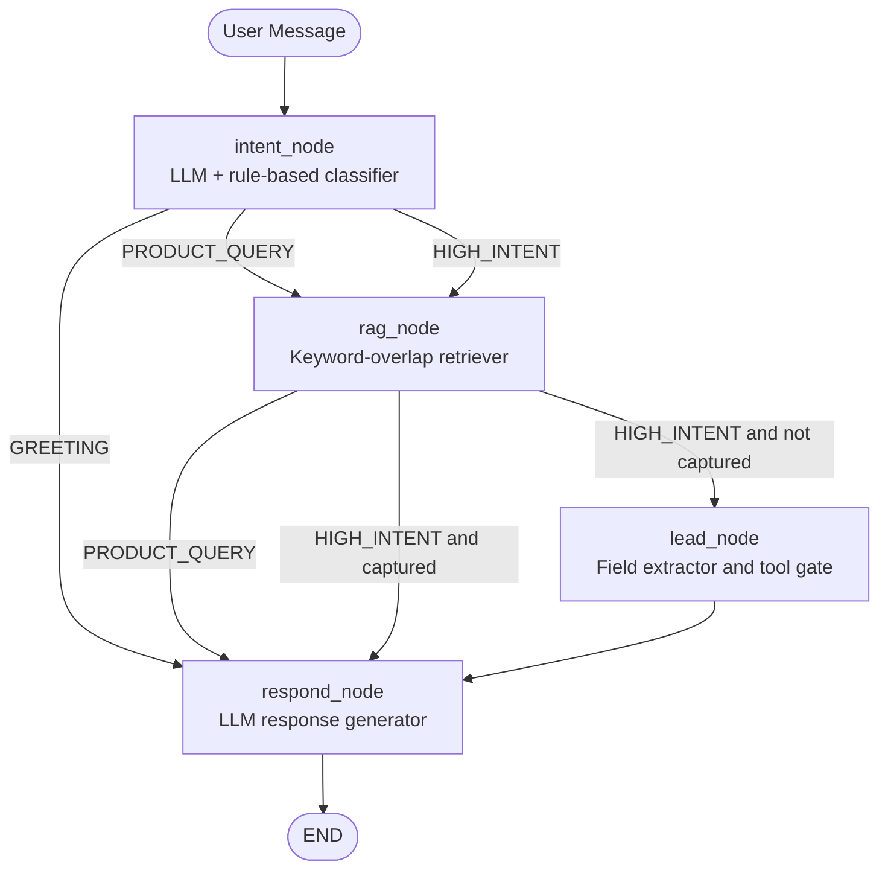
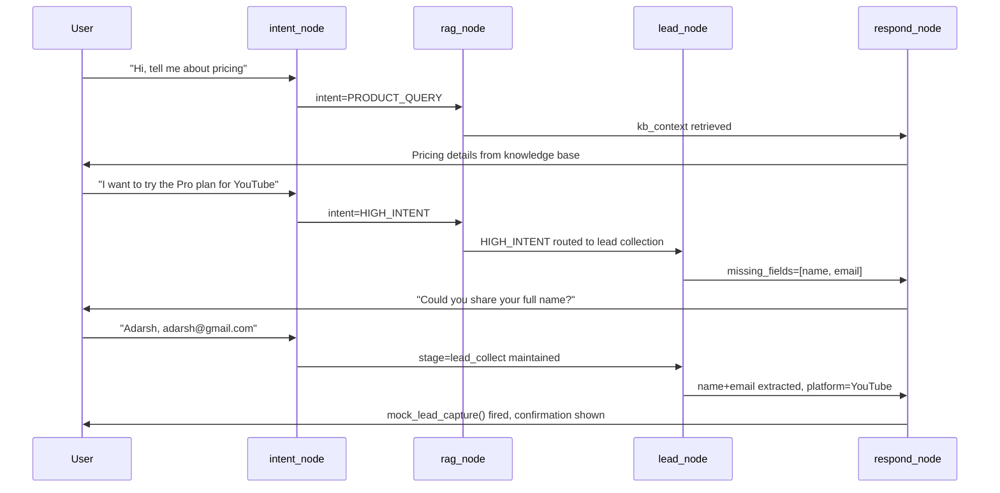

<div align="center">
  <h1>AutoStream Lead Intelligence</h1>
  <p><b>Social-to-Lead Agentic Workflow</b></p>
  <p><i>A 4-node LangGraph AI agent that converts social media conversations into qualified business leads — with intent detection, RAG-powered knowledge retrieval, and automated lead capture.</i></p>

  <br />

  [](https://www.python.org/)
  [](https://langchain-ai.github.io/langgraph/)
  [](https://ai.google.dev/)
  [](https://streamlit.io/)
  [](LICENSE)
</div>

---

## Table of Contents

- [What This Does](#what-this-does)
- [Architecture](#architecture)
- [The 4-Node Agent Pipeline](#the-4-node-agent-pipeline)
- [Pipeline Flow Diagram](#pipeline-flow-diagram)
- [Tech Stack](#tech-stack)
- [Project File Structure](#project-file-structure)
- [Local Setup](#local-setup)
- [Environment Variables](#environment-variables)
- [Running the App](#running-the-app)
- [Running Tests](#running-tests)
- [Dashboard Pages](#dashboard-pages)
- [WhatsApp Deployment](#whatsapp-deployment)
- [Acknowledgements](#acknowledgements)

---

## What This Does

AutoStream Lead Intelligence is a conversational AI agent built for **ServiceHive's Inflx** assignment. It simulates a real-world Social-to-Lead workflow for **AutoStream**, a fictional SaaS platform for video content creators.

The agent does three things automatically:

1. **Classifies intent** — Greeting, Product Inquiry, or High-Intent Lead
2. **Answers product questions** — Using RAG over a local Markdown knowledge base (pricing, features, policies)
3. **Captures leads** — Collects name, email, and platform one field at a time, then fires `mock_lead_capture()` exactly once

The Streamlit UI provides three views: a live **Chat** interface with a funnel progress indicator, a **Dashboard** with real-time agent state and lead analytics, and an **Architecture** page explaining the full pipeline.

---

## Architecture

The system is built on a **LangGraph `StateGraph`** — a directed graph where each node is a pure function that reads and writes a shared `AgentState` TypedDict. State persists across all conversation turns inside the Streamlit session, giving the agent memory across 5–6 exchanges without any external database.

Every user message enters at `intent_node`, which classifies it using the Gemini 3.1 Flash-Lite LLM with a rule-based fallback. Conditional edges then route the message: greetings skip directly to `respond_node`; product queries pass through `rag_node` for knowledge retrieval; high-intent signals pass through both `rag_node` and `lead_node` for field extraction. The `respond_node` always generates the final reply using the full accumulated context.

The `lead_node` enforces a strict tool gate: `mock_lead_capture()` is called exactly once, only after all three fields (name, email, platform) are collected and validated. The `is_tool_called` flag prevents duplicate captures across turns.

The Streamlit UI is a **channel-agnostic wrapper** — the same `agent_app.invoke()` call can power WhatsApp, Slack, or any other channel without changing the agent logic.

---

## The 4-Node Agent Pipeline

| Node | Responsibility | Input | Output | Routing |
|---|---|---|---|---|
| `intent_node` | Classifies user intent via Gemini LLM + rule fallback | Latest message | `intent` field | GREETING → respond, else → rag |
| `rag_node` | Keyword-overlap retrieval from `knowledge_base.md` | Latest message | Top-3 relevant sections | HIGH_INTENT → lead, else → respond |
| `lead_node` | Extracts name/email/platform; fires `mock_lead_capture()` | Full conversation | Lead fields + `is_tool_called` | Always → respond |
| `respond_node` | Generates final reply using LLM + full context | Full state | `AIMessage` appended to messages | → END |

---

## Pipeline Flow Diagram



### State Flow



---

## Tech Stack

| Component | Technology | Version | Why |
|---|---|---|---|
| LLM | Google Gemini 3.1 Flash-Lite Preview | `gemini-3.1-flash-lite-preview` | Fastest, most cost-efficient Gemini model; optimized for agentic tasks |
| Agent Framework | LangGraph | >=0.2.0 | Stateful graph with conditional routing and typed state |
| LLM Bindings | LangChain Google GenAI | >=2.0.0 | Official LangChain integration for Gemini |
| UI | Streamlit | >=1.30.0 | Rapid multi-page dashboard with session state |
| Language | Python | 3.9+ | Assignment requirement |
| Validation | Pydantic | >=2.0.0 | Structured output parsing for intent and lead fields |
| RAG | Custom keyword-overlap | — | No vector DB needed; fast and deterministic |
| Testing | pytest | >=8.0.0 | Full unit and property-based test coverage |

---

## Project File Structure

```text
Social-to-Lead Agentic Workflow/
├── agent/
│   ├── __init__.py          # Package marker
│   ├── graph.py             # LangGraph StateGraph — 4 nodes + conditional routing
│   ├── intent.py            # Intent classification + email/platform extraction
│   ├── rag.py               # Keyword-overlap RAG retriever over knowledge_base.md
│   ├── state.py             # AgentState TypedDict + default_state()
│   └── tools.py             # mock_lead_capture() — simulated CRM API call
├── data/
│   └── knowledge_base.md    # AutoStream pricing, features, and policies
├── tests/
│   ├── __init__.py
│   └── test_core.py         # 44 unit + property-based tests
├── app.py                   # Streamlit multi-page dashboard (Chat / Dashboard / Architecture)
├── requirements.txt         # Python dependencies
├── .env.example             # Environment variable template
├── .env                     # Local secrets (not committed)
├── .gitignore
├── Dockerfile               # Container build for deployment
└── README.md
```

---

## Local Setup

### 1. Clone the repository

```bash
git clone https://github.com/adarshcod30/Inflx.git
cd Inflx
```

### 2. Create and activate the virtual environment

```bash
python3 -m venv autostream_env

# macOS / Linux
source autostream_env/bin/activate

# Windows
autostream_env\Scripts\activate
```

### 3. Install dependencies

```bash
pip install -r requirements.txt
```

### 4. Configure environment variables

```bash
cp .env.example .env
```

Open `.env` and set your Gemini API key:

```env
GOOGLE_API_KEY=your-gemini-api-key-here
AUTOSTREAM_MODEL=gemini-3.1-flash-lite-preview
```

Get your free API key at: https://aistudio.google.com/apikey

---

## Environment Variables

| Variable | Required | Default | Description |
|---|---|---|---|
| `GOOGLE_API_KEY` | Yes | — | Gemini API key from Google AI Studio |
| `AUTOSTREAM_MODEL` | No | `gemini-3.1-flash-lite-preview` | Override the Gemini model name |

---

## Running the App

```bash
streamlit run app.py
```

The app opens at `http://localhost:8501` with three pages accessible from the sidebar:

- **Chat** — Conversational interface with funnel progress indicator
- **Dashboard** — Live agent state, session metrics, and lead profile
- **Architecture** — Pipeline diagram, routing table, and state schema

---

## Running Tests

```bash
pytest tests/test_core.py -v
```

The test suite covers 44 cases across:

- RAG retrieval accuracy (pricing, policies, support)
- Mock lead capture tool execution
- Intent classification (rule-based fallback)
- Email and platform extraction
- State management and default state keys
- Graph compilation and node connectivity
- Model name correctness (`gemini-3.1-flash-lite-preview`)
- UI constants (`STAGE_TO_INDEX`, `FUNNEL_STEPS`)
- UI function presence (`render_funnel`, `render_lead_card`, all page renderers)

---

## Dashboard Pages

### Chat Page

The main conversational interface. Shows a 4-step funnel progress indicator at the top (Greeting → Inquiry → Lead Collection → Captured) that updates as the conversation progresses. Chat bubbles are styled differently for user and agent messages. When a lead is captured, a structured lead card appears below the chat showing name, email, platform, plan interest, and capture timestamp.

### Dashboard Page

Three-column live analytics view:
- **Recent Conversation** — Last 6 messages as compact read-only bubbles
- **Agent State** — Live metrics: intent classification, conversation stage, qualification status, last response latency, total turns
- **Lead Profile** — Field-by-field status (Pending → filled) with the lead capture card when complete

### Architecture Page

Full system explanation for anyone without prior context:
- Pipeline overview in plain English
- Mermaid flow diagram of the 4-node graph with routing conditions
- Routing logic table (from node → condition → to node → reason)
- `AgentState` schema rendered as JSON
- Technology stack table
- WhatsApp deployment guide

---

## WhatsApp Deployment

The LangGraph backend is **channel-agnostic** — deploying to WhatsApp requires only a thin webhook adapter. The core agent logic is unchanged.

### Architecture

1. Register a **Twilio WhatsApp Sandbox** (or production number) at twilio.com
2. Deploy a **FastAPI** webhook server that exposes `POST /webhook`
3. Twilio forwards every incoming WhatsApp message to your webhook as an HTTP POST
4. The webhook reconstructs `AgentState` from a persistent store (Redis or DynamoDB), calls `agent_app.invoke(state)`, and sends the AI response back via the Twilio REST API
5. The Streamlit UI remains a **separate deployment** — both channels share the same `agent_app` Python package

### Example Webhook

```python
# webhook.py
from fastapi import FastAPI, Form
from twilio.rest import Client
from langchain_core.messages import HumanMessage
from agent.graph import agent_app
from agent.state import default_state

app = FastAPI()
twilio_client = Client()  # reads TWILIO_ACCOUNT_SID and TWILIO_AUTH_TOKEN from env

@app.post("/webhook")
async def whatsapp_webhook(Body: str = Form(), From: str = Form()):
    # Load or create session state (use Redis/DynamoDB for persistence)
    state = load_state(From) or default_state()
    state["messages"].append(HumanMessage(content=Body))

    # Run the LangGraph agent
    result = agent_app.invoke(state)
    save_state(From, result)  # persist updated state

    # Send reply via Twilio
    reply = result["messages"][-1].content
    twilio_client.messages.create(
        body=reply,
        from_="whatsapp:+14155238886",  # Twilio sandbox number
        to=From,
    )
    return {"status": "ok"}
```

### Deployment Steps

```bash
# Install additional deps
pip install fastapi uvicorn twilio redis

# Run the webhook server
uvicorn webhook:app --host 0.0.0.0 --port 8000

# Expose locally for testing (use ngrok)
ngrok http 8000
# Set the ngrok URL as your Twilio webhook: https://xxxx.ngrok.io/webhook
```

---

## Acknowledgements

**Developed by Adarsh Dwivedi**

- GitHub: [github.com/adarshcod30](https://github.com/adarshcod30)
- LinkedIn: [linkedin.com/in/adarshdwivedi30](https://www.linkedin.com/in/adarshdwivedi30)

Built as the ML Intern assignment for **ServiceHive — Inflx** (Social-to-Lead Agentic Workflow).

<div align="center">
  <b>Architected by Adarsh Dwivedi — AutoStream Lead Intelligence</b>
</div>
