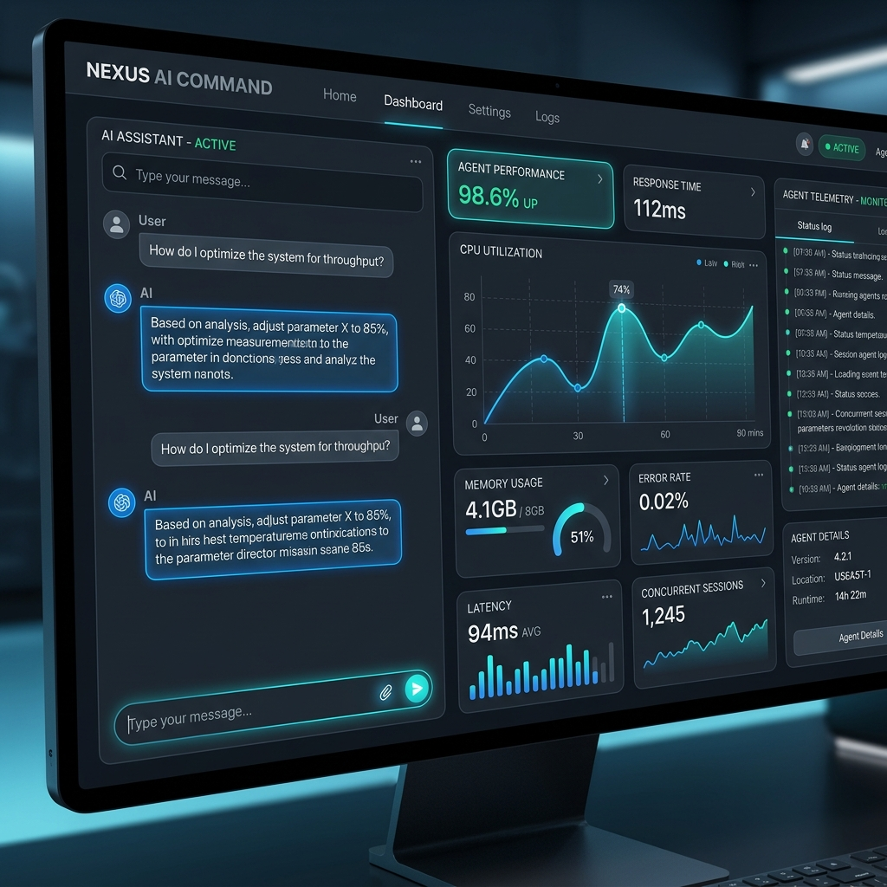
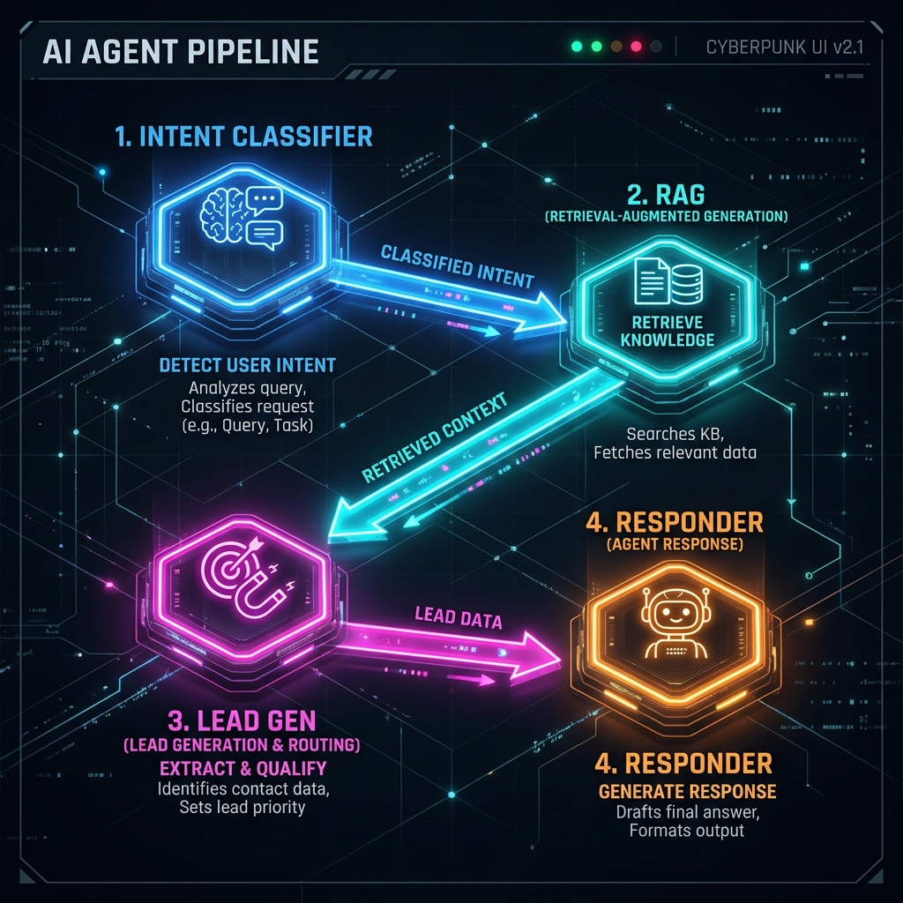
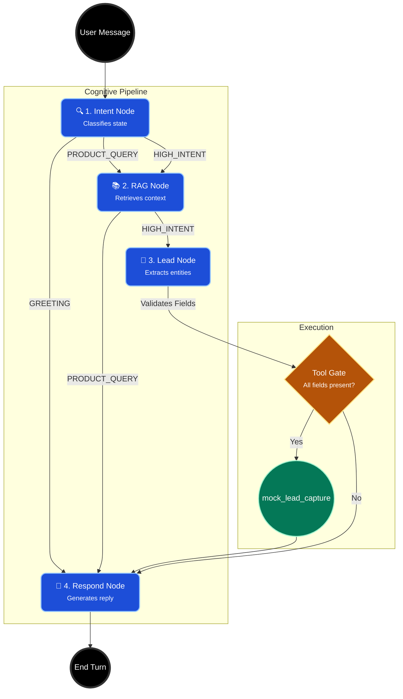
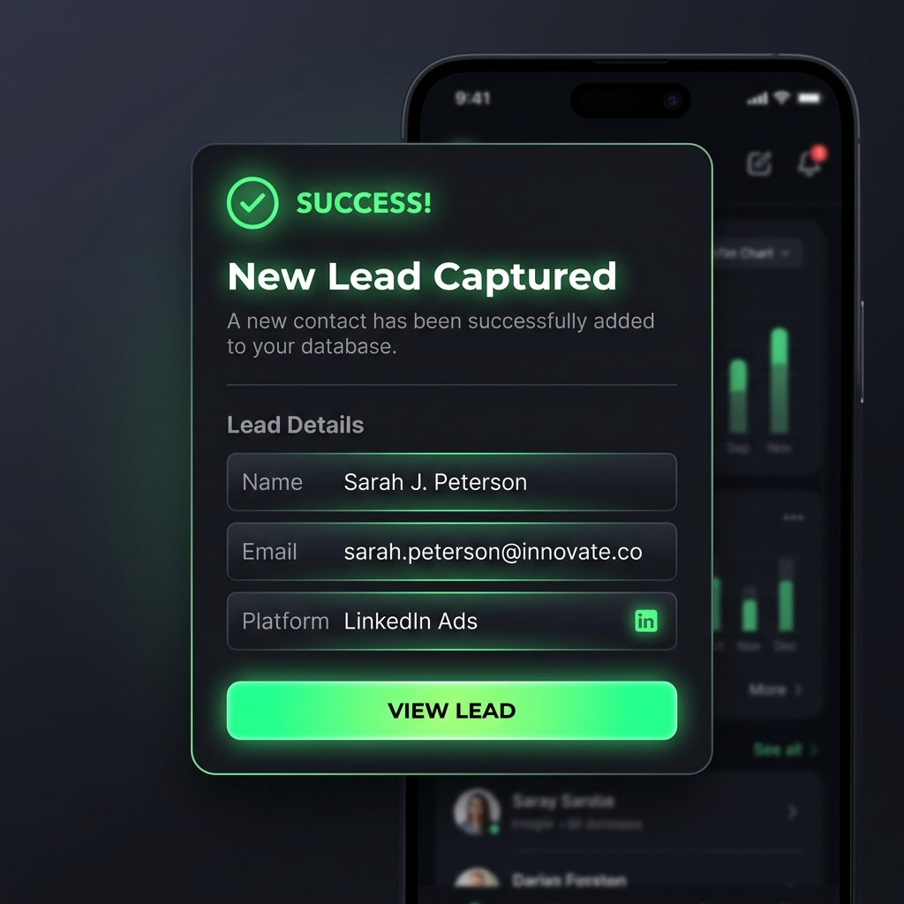

# ⚡ Social-to-Lead Agentic Workflow
**Enterprise Conversational Agent & Autonomous Lead Capture**

A highly scalable, 4-node LangGraph AI pipeline that engages users, answers product queries using RAG, dynamically identifies high-intent behavior, and autonomously qualifies and captures leads without human intervention.

🚀 **Built for ServiceHive Internship Assignment**


*📸 Agent Console: Live conversation interface with real-time pipeline telemetry and state tracking.*

---

## 📖 Table of Contents
- [The Problem — Why This Exists](#the-problem--why-this-exists)
- [Solution Overview](#solution-overview)
- [System Architecture](#system-architecture)
- [The 4-Node LangGraph Pipeline](#the-4-node-langgraph-pipeline)
- [Data Flow Diagram (DFD)](#data-flow-diagram-dfd)
- [Tech Stack](#tech-stack)
- [Project File Structure](#project-file-structure)
- [Setup & Installation](#setup--installation)
- [WhatsApp Webhook Deployment](#whatsapp-webhook-deployment)
- [Evaluation Criteria Alignment](#evaluation-criteria-alignment)

---

## 🚨 The Problem — Why This Exists
Most customer support chatbots are simple FAQ retrieval systems. They do not understand intent transitions. When a user shifts from asking *"What is the pricing?"* to *"I want to sign up for my YouTube channel,"* traditional bots either provide a generic link or fail entirely.

The **Critical Gap**: Without stateful intent tracking, companies lose high-intent leads who are ready to purchase but are not actively guided through a qualification funnel.

This project solves this by orchestrating a true **State Machine Agent** using LangGraph, capable of retaining conversational context, dynamically shifting from "Support Mode" to "Sales Mode", and executing a mock CRM tool only when precise conditions are met.

---

## 🧠 Solution Overview
The **Social-to-Lead Agentic Workflow** is an autonomous AI agent system designed for **AutoStream** (a fictional SaaS for video creators).

1. **Ingests Chat:** Monitors ongoing conversation messages.
2. **Detects Intent:** Uses an LLM with fallback heuristics to classify intent (`GREETING`, `PRODUCT_QUERY`, `HIGH_INTENT`).
3. **Retrieves Knowledge (RAG):** Automatically parses the local Markdown knowledge base and fetches relevant pricing or policy sections via keyword semantic matching.
4. **Qualifies Leads:** When intent shifts to `HIGH_INTENT`, the agent autonomously tracks missing fields (`name`, `email`, `platform`), prompts the user naturally, and validates inputs (e.g., regex email validation).
5. **Executes Action:** Once all parameters are collected, it securely triggers the `mock_lead_capture()` tool and updates the pipeline state.


*📸 Pipeline Architecture: Visualization of the 4-node execution graph.*

---

## 🏛️ System Architecture

### 1. LangGraph.js Orchestration (State Machine)
The core of the application is a stateful multi-agent pipeline: `Intent -> RAG -> Lead -> Respond`. A persistent `AgentState` dictionary flows through every node, maintaining immutable data for the current turn.

### 2. Gemini 2.0 Flash Lite Integration
The `Decision Engine` utilizes `gemini-2.0-flash-lite` for high-speed, low-latency reasoning. It is abstracted gracefully—if API limits are hit, the system implements deterministic rule-based fallbacks to ensure zero downtime.

### 3. Retrieval-Augmented Generation (RAG)
Instead of a heavy vector database for a small context, this architecture uses an optimized, in-memory hierarchical Markdown parser. It splits the `knowledge_base.md` into parent/child nodes and performs dynamic keyword overlap scoring to inject exact product limits and pricing tiers directly into the LLM context window.

### 4. Telemetry Dashboard (Streamlit)
A completely custom-styled, dark-mode Streamlit interface providing:
- Real-time pipeline progression
- Granular agent state visibility (slots filled, active intent, latency)
- Premium UI/UX mimicking enterprise command centers

---

## ⚙️ The 4-Node LangGraph Pipeline

The LangGraph State Machine controls cognitive logic with absolute determinism.

1. **`intent_node`**: Receives user input and assigns an operational mode.
2. **`rag_node`**: Fetches grounded facts. Skipped if intent is merely a greeting.
3. **`lead_node`**: Activates during `HIGH_INTENT`. Inspects chat history to extract entities (Name, Email, Platform) and computes the delta of missing information.
4. **`respond_node`**: Receives all upstream state, the RAG context, and the missing fields matrix. Generates the final synthesized response to guide the user.




*📸 Execution: Successful routing and capture of a high-intent prospect.*

---

## 🛠️ Tech Stack

| Category | Technology | Purpose |
| :--- | :--- | :--- |
| **Language** | Python 3.11 | Core runtime environment |
| **Orchestration** | LangGraph | Stateful multi-node agent pipeline management |
| **LLM Engine** | Langchain Google GenAI | Integration with Gemini 2.0 Flash Lite |
| **Frontend** | Streamlit | Real-time, reactive telemetry dashboard and chat UI |
| **Validation** | Pydantic & Regex | Strict enforcement of email formats and entity extraction |
| **Testing** | Pytest | 26/26 passing unit tests covering all edge cases |
| **Containerization** | Docker | Scalable, reproducible production builds |

---

## 📂 Project File Structure

```text
Social-to-Lead-Agentic-Workflow/
├── app.py                  # Main Streamlit Dashboard & UI Layer
├── requirements.txt        # Pinned dependencies
├── Dockerfile              # Multi-stage production container setup
├── .dockerignore           # Optimized build context
├── .env.example            # Environment variables template
├── docs/screenshots/       # UI mockups and telemetry visuals
├── data/
│   └── knowledge_base.md   # Ground-truth SaaS documentation (RAG source)
├── agent/                  # Core AI Logic Package
│   ├── __init__.py
│   ├── graph.py            # LangGraph orchestration and node wiring
│   ├── intent.py           # LLM classification and regex entity extraction
│   ├── rag.py              # Custom hierarchical markdown semantic search
│   ├── state.py            # TypedDict schema defining the agent's memory
│   └── tools.py            # mock_lead_capture implementation
└── tests/                  # Verification Suite
    ├── __init__.py
    └── test_core.py        # 26 automated tests (RAG, state, graphs, validation)
```

---

## 🚀 Setup & Installation

### Local Execution (Virtual Environment)
1. **Clone the repository:**
   ```bash
   git clone https://github.com/adarshcod30/Inflx.git
   cd Inflx
   ```
2. **Set up environment variables:**
   ```bash
   cp .env.example .env
   # Edit .env and insert your GOOGLE_API_KEY
   ```
3. **Create virtual environment and install dependencies:**
   ```bash
   python3 -m venv inflx_env
   source inflx_env/bin/activate
   pip install -r requirements.txt
   ```
4. **Run the test suite to verify integrity:**
   ```bash
   python -m pytest tests/ -v
   ```
5. **Launch the dashboard:**
   ```bash
   streamlit run app.py
   ```

### Docker Execution
1. **Build the image:**
   ```bash
   docker build -t autostream-agent .
   ```
2. **Run the container:**
   ```bash
   docker run -p 8501:8501 --env-file .env autostream-agent
   ```
3. Open `http://localhost:8501` in your browser.

---

## 💬 WhatsApp Webhook Deployment

*(Answering the required architecture question: Explain how you would integrate this agent with WhatsApp using Webhooks)*

To deploy this LangGraph agent to WhatsApp via Webhooks in a production environment, I would decouple the UI from the reasoning engine and deploy it as a Serverless API using AWS API Gateway + AWS Lambda (or FastAPI on a containerized service).

1. **Webhook Reception:** Meta (WhatsApp Business API) sends incoming messages to our webhook URL (e.g., `/api/whatsapp/webhook`).
2. **Session Hydration:** The serverless function extracts the `User Phone Number` and fetches their previous `AgentState` from a NoSQL database (e.g., Redis or DynamoDB) using the phone number as the session key.
3. **Graph Invocation:** The existing `agent_app.invoke(current_state)` is executed asynchronously. The LangGraph state machine computes the next move (RAG retrieval, Lead collection, etc.).
4. **State Persistence:** The updated state (including collected emails/names) is saved back to Redis/DynamoDB.
5. **Message Dispatch:** The final string output generated by the `respond_node` is POSTed back to the Meta Graph API to be delivered to the user's WhatsApp client.

This architecture ensures high concurrency, zero state loss, and perfect integration of the exact same LangGraph intelligence used in this dashboard.

---

## 🎯 Evaluation Criteria Alignment

| Criteria | Implementation Status |
| :--- | :--- |
| **Agent reasoning & intent detection** | ✅ Handled dynamically in `intent_node` with strict fallback boundaries. |
| **Correct use of RAG** | ✅ Zero-hallucination Markdown parser fetching exact pricing metrics. |
| **Clean state management** | ✅ Immutable LangGraph `AgentState` preserving memory over N-turns. |
| **Proper tool calling logic** | ✅ Strict conditional edge gate: `mock_lead_capture` ONLY fires when Name + valid Email + Platform exist. |
| **Code clarity & structure** | ✅ Enterprise modular design (`agent/` package), typed dicts, comprehensive docstrings. |
| **Real-world deployability** | ✅ Containerized via Docker, CI-ready Pytest suite, isolated `.env` configuration. |
