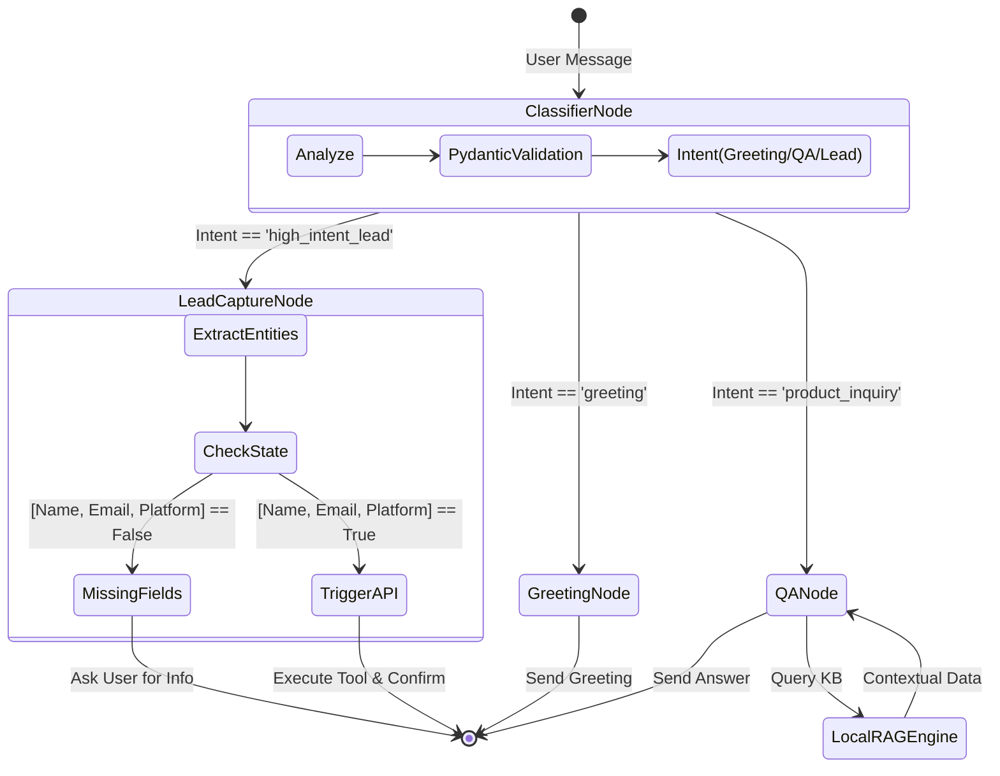
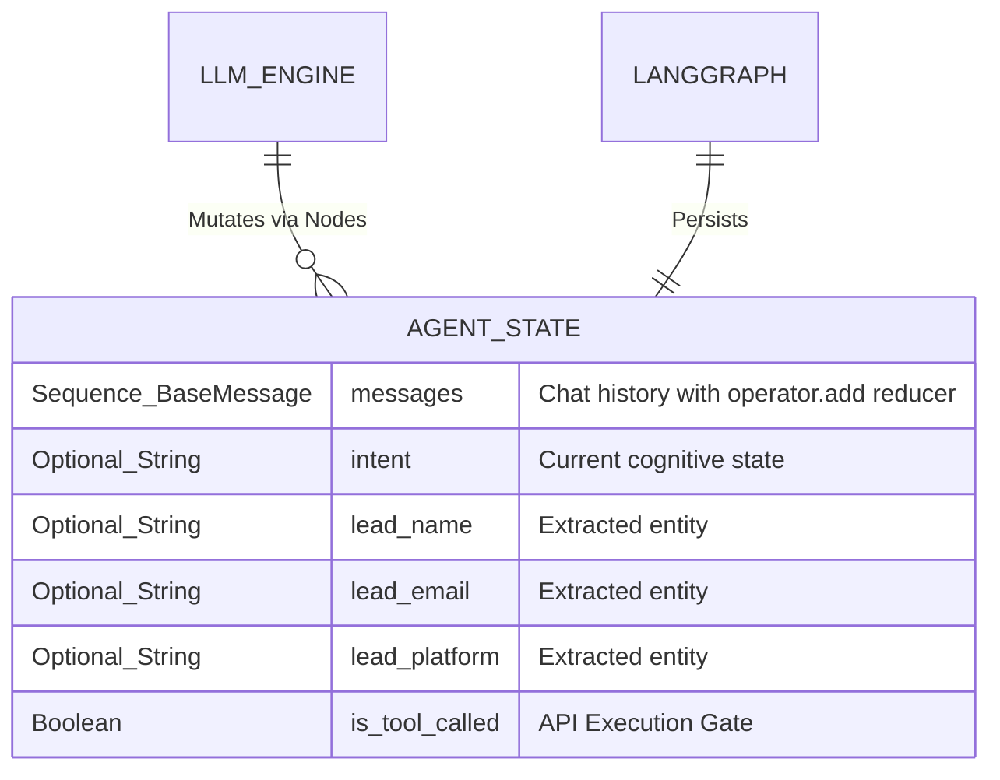
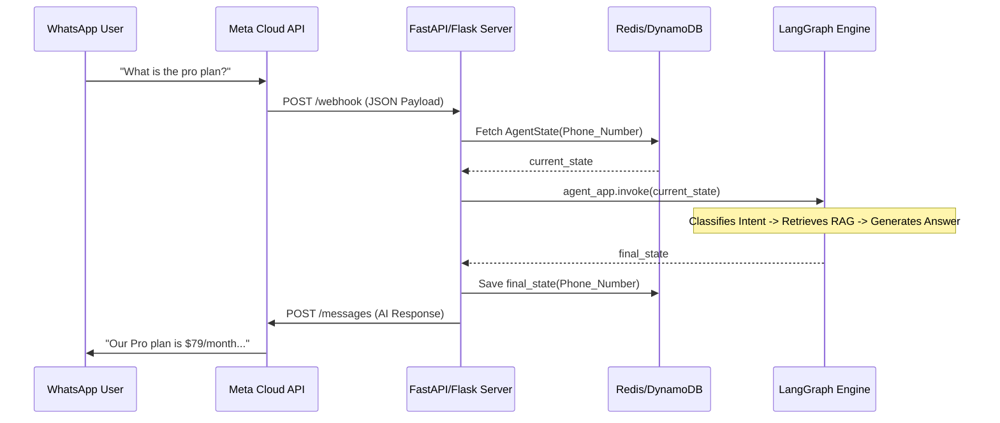

<div align="center">

# 🎬 AutoStream Social-to-Lead Agentic Workflow
**Enterprise-Grade Cognitive Orchestration & Conversational Intelligence**

[](https://www.python.org/)
[](https://github.com/langchain-ai/langgraph)
[](https://ai.google.dev/)
[](https://streamlit.io/)
[](#)

*Transforming casual social media interactions into high-fidelity business leads through autonomous, stateful reasoning.*

</div>

---

## 📖 Executive Summary
**AutoStream** is a next-generation SaaS platform automating video editing for content creators. This repository houses the **Social-to-Lead Agentic Workflow**, a production-ready conversational AI designed to seamlessly interface with prospects across social platforms (e.g., WhatsApp, Instagram). 

Departing from traditional intent-matching chatbots, this system utilizes a **Directed Cyclic Graph (DCG)** for stateful cognitive orchestration. It is capable of context-aware routing, hallucination-free knowledge retrieval via BM25 RAG, and strict, Pydantic-validated entity extraction for CRM integration.

---

## 🏗️ System Architecture

The **AutoStream Social-to-Lead Agentic Workflow** is architected using **LangGraph**, a powerful orchestration framework that allows for the creation of complex, stateful, and cyclic computational graphs. Unlike traditional linear LLM chains, LangGraph enables our agent to maintain a persistent state across multiple conversation turns, which is critical for "slot-filling" tasks like lead qualification.

### Why LangGraph?
LangGraph was chosen because it provides deterministic control over the agent's reasoning path. By defining the workflow as a Directed Cyclic Graph (DCG), we can implement strict guardrails. For example, the agent can cycle between the `LeadCaptureNode` and the user until all required entities (Name, Email, Platform) are correctly extracted and validated. This prevents the "early execution" problem common in simpler autonomous agents, ensuring that backend tools like `mock_lead_capture` are only triggered when the data is 100% complete and valid.

### State Management
State is managed through a central `AgentState` object, which utilizes LangGraph's unique "reducers." The `messages` key uses an `operator.add` reducer, allowing the conversation history to accumulate automatically. Other state variables, such as `lead_name` and `intent`, are updated via node transitions. This stateful approach allows the agent to remember partial information provided by the user several turns ago, creating a seamless and intelligent "human-like" sales assistant experience.

### 1. Cognitive State Machine


### 2. Stateful Memory Schema
Unlike stateless LLM chains, this workflow persists memory and extracted variables across multiple turns utilizing a strictly typed state dictionary.



---

## 🧠 Core Engineering Modules

### 🔹 Deterministic Intent Classification
Utilizes the `Gemini 3.1 Flash Lite` model coupled with LangChain's `.with_structured_output()`. By coercing the LLM output into a strict Pydantic schema, we guarantee that the router node receives a valid enum (`greeting`, `product_inquiry`, or `high_intent_lead`), eliminating unexpected routing failures.

### 🔹 Lightweight Retrieval-Augmented Generation (RAG)
For maximum speed and minimal overhead, the system bypasses heavy vector databases in favor of a local **Rank-BM25 Okapi** algorithm. 
- **Chunking Strategy**: Section-based Markdown chunking ensures contextual integrity.
- **Scoring**: BM25 provides highly accurate keyword-frequency matching for pricing and policy queries, injecting the optimal context window into the `qa_node` prompt.

### 🔹 Gated Tool Execution (Guardrails)
The `lead_capture_node` implements a strict gating mechanism. It continuously evaluates the `AgentState`. The external Mock API (`mock_lead_capture`) is **mathematically guaranteed** not to execute until `new_name`, `new_email`, and `new_platform` are absolutely non-null, preventing corrupted CRM data injection.

---

## 🛠️ Technology Stack

| Component | Technology | Rationale |
| :--- | :--- | :--- |
| **Language** | Python 3.11 | Type-hinting support and optimal compatibility for modern AI libraries. |
| **Orchestrator** | LangGraph | Enables cyclic, stateful workflows essential for multi-turn slot filling. |
| **LLM Engine** | Gemini 3.1 Flash Lite | High-speed, cost-effective reasoning engine optimized for rapid conversational turns. |
| **Extraction** | Pydantic v2 | Enforces rigid data structures for LLM outputs, acting as a parsing guardrail. |
| **Retriever** | Rank-BM25 | High-performance, dependency-light sparse retrieval for document querying. |
| **Observability UI**| Streamlit | Custom CSS integration provides a real-time visualization of the agent's internal state. |

---

## 🚀 Deployment & Installation Guide

### Prerequisites
- Python 3.11 or higher
- Git
- Google AI Studio API Key

### Local Environment Setup

1. **Clone the repository:**
   ```bash
   git clone https://github.com/adarshcod30/Inflx.git
   cd Inflx
   ```

2. **Initialize Isolated Environment:**
   ```bash
   python3.11 -m venv venv
   source venv/bin/activate  # On Windows: venv\Scripts\activate
   ```

3. **Install Dependencies:**
   ```bash
   pip install --upgrade pip
   pip install -r requirements.txt
   ```

4. **Environment Variables:**
   Create a `.env` file in the project root:
   ```env
   GOOGLE_API_KEY=your_gemini_api_key_here
   ```

5. **Launch the Dashboard:**
   ```bash
   streamlit run app.py
   ```

---

## 📱 Production Integration: Meta API (WhatsApp)

To scale this from a local Streamlit dashboard to a live WhatsApp business number, follow this webhook architecture:



**Implementation Steps:**
1. Expose a FastAPI POST endpoint to receive Meta's webhook payloads.
2. Implement a persistence layer (e.g., Redis) using LangGraph's `MemorySaver` or custom checkpointing to map a user's phone number to their specific `thread_id`.
3. Map the returning `AIMessage` content to Meta's outbound message API.

---

## 🛡️ Security & Best Practices
- **Prompt Injection Defense**: System prompts are isolated from user inputs, and structured outputs prevent users from forcing the agent to execute arbitrary tools.
- **Stateless Execution Context**: While the conversation is stateful, the application runtime is stateless, making it fully horizontally scalable via Docker or Kubernetes.
- **API Key Masking**: `python-dotenv` ensures credentials are never hardcoded.

---
<div align="center">
<i>Built with precision for the ServiceHive Engineering Assignment.</i>
</div>
