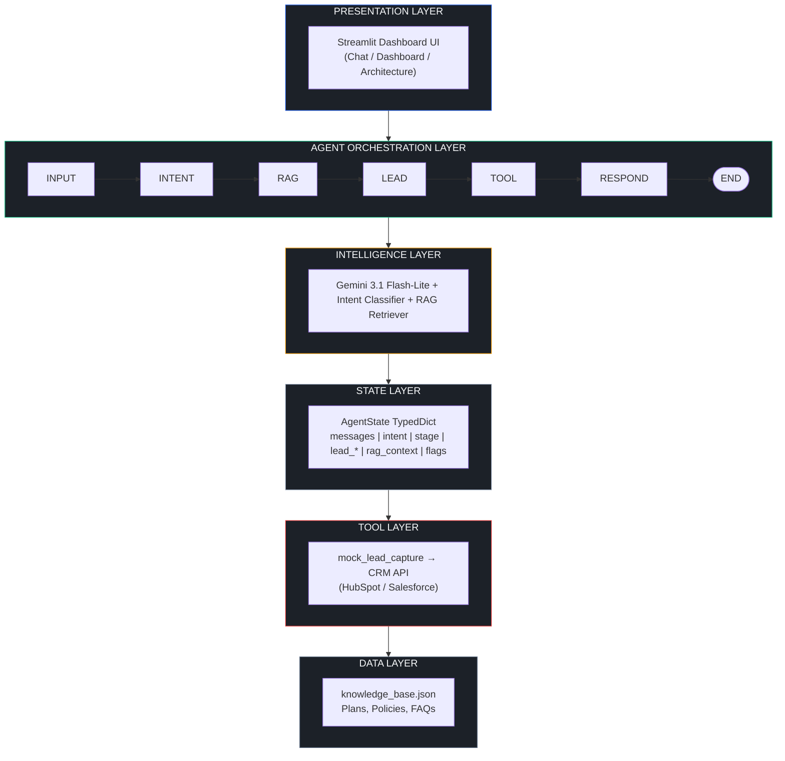
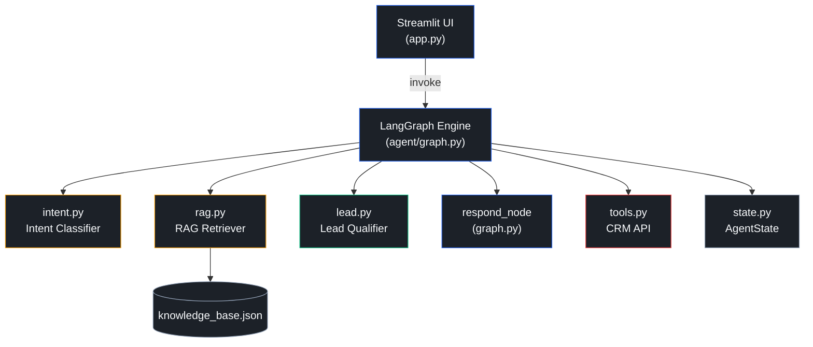
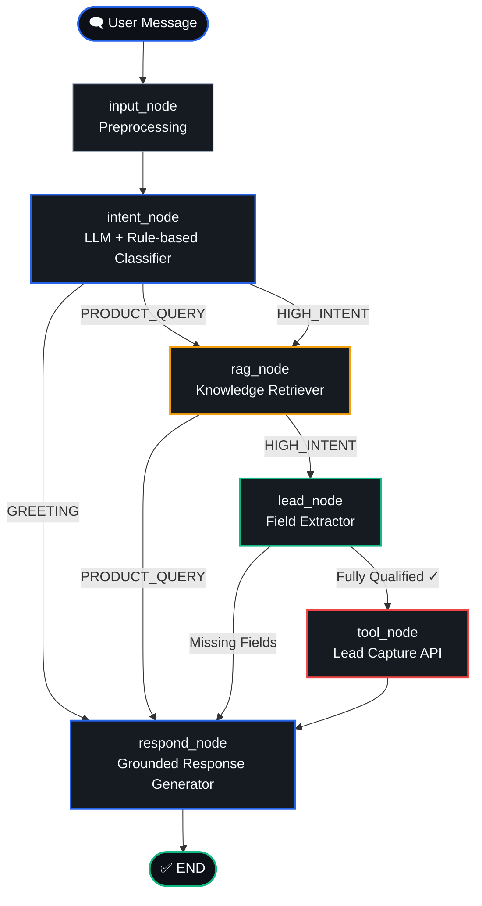
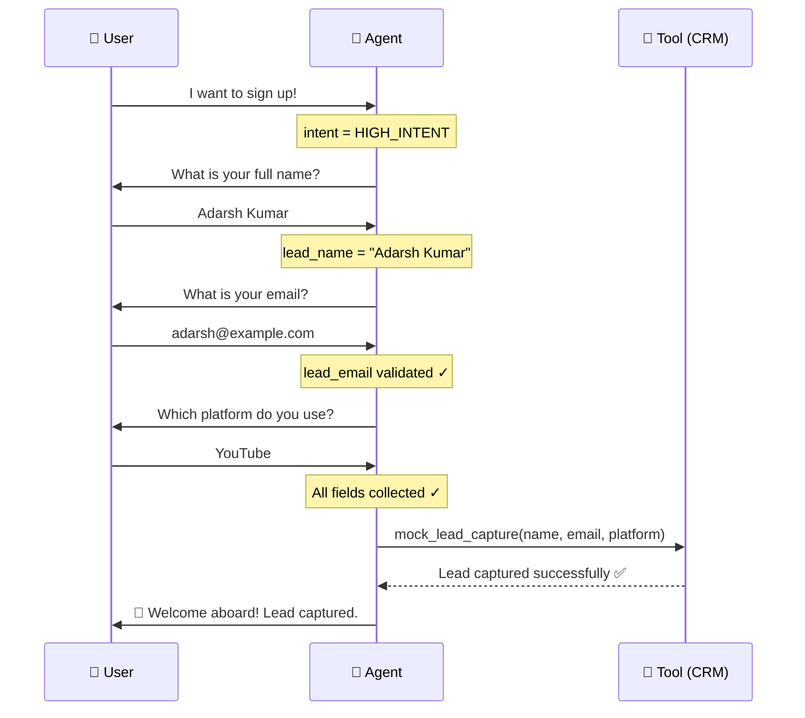
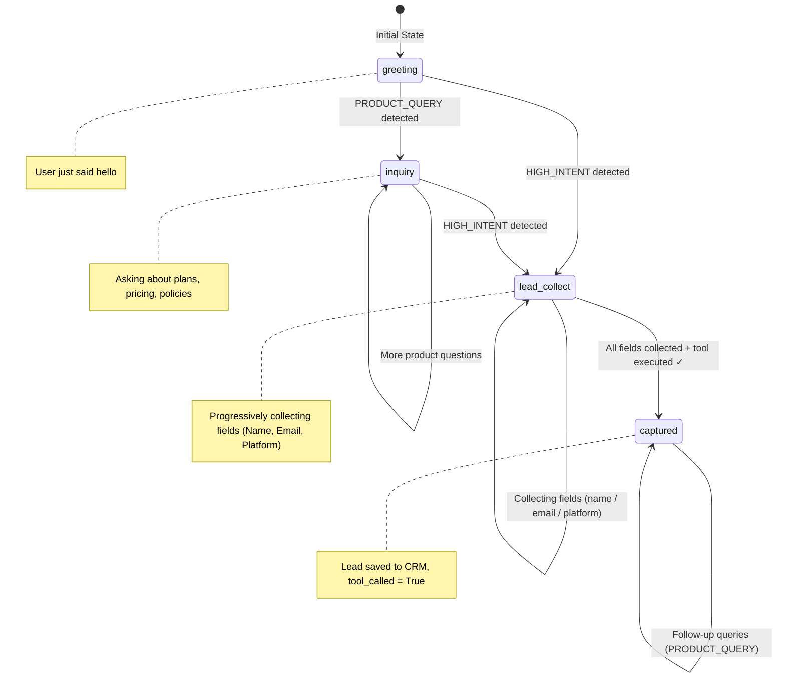
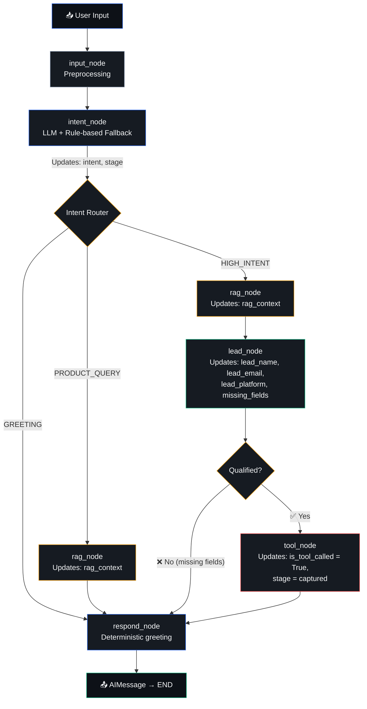
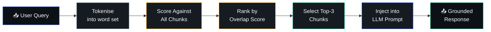

<div align="center">

# 🎬 AutoStream — Social-to-Lead Agentic Workflow

**An AI-powered conversational agent that converts social media interactions into qualified business leads**

[](https://python.org)
[](https://langchain-ai.github.io/langgraph/)
[](https://ai.google.dev)
[](https://streamlit.io)
[](tests/)

---

*Built for the ServiceHive Inflx Platform — Production-grade conversational AI for SaaS lead generation*

</div>

---

## 📋 Table of Contents

- [Project Overview](#-project-overview)
- [System Architecture](#-system-architecture)
- [Workflow Diagrams](#-workflow-diagrams)
- [Low-Level Design](#-low-level-design)
- [Tech Stack Justification](#-tech-stack-justification)
- [State Management](#-state-management)
- [RAG Implementation](#-rag-implementation)
- [Tool Execution Logic](#-tool-execution-logic)
- [Streamlit UI](#-streamlit-ui)
- [Setup Instructions](#-setup-instructions)
- [WhatsApp Integration](#-whatsapp-integration)
- [Demo](#-demo)
- [Evaluation Mapping](#-evaluation-mapping)

---

## 🎯 Project Overview

### Problem

Social media platforms generate enormous volumes of user interactions, but most businesses lack the intelligence layer to identify **high-intent prospects** and convert them into qualified leads in real-time. Manual processes are slow, inconsistent, and unscalable.

### Solution

AutoStream's Social-to-Lead Agentic Workflow is a **multi-node LangGraph state machine** that:

1. **Understands** user intent through LLM + rule-based classification
2. **Retrieves** accurate product information via RAG (no hallucination)
3. **Detects** high-intent signals and initiates lead capture
4. **Collects** lead data incrementally (Name → Email → Platform)
5. **Executes** the CRM tool **only** after full validation

### Key Features

| Feature | Description |
|---------|-------------|
| 🧠 **Intent Detection** | Dual-layer LLM + rule-based classifier (GREETING / PRODUCT_QUERY / HIGH_INTENT) |
| 📚 **RAG Grounding** | JSON knowledge base with keyword-overlap retrieval — zero hallucination |
| 🔄 **Stateful Memory** | Multi-turn conversation tracking across 5–6+ turns |
| 🎯 **Lead Qualification** | Progressive field collection with validation gates |
| 🔧 **Tool Gating** | Strict precondition checks — tool fires ONLY when fully qualified |
| 🖥️ **Professional UI** | SaaS-grade Streamlit dashboard with funnel tracking |
| 📱 **Channel-Agnostic** | Same backend powers Streamlit, WhatsApp, Slack, etc. |

---

## 🏗 System Architecture

### High-Level Architecture



### Layered Architecture

| Layer | Responsibility | Implementation |
|-------|---------------|----------------|
| **Presentation** | User interaction, chat display, analytics | `app.py` (Streamlit) |
| **Orchestration** | Graph execution, conditional routing | `agent/graph.py` (LangGraph) |
| **Intelligence** | Intent classification, response generation | `agent/intent.py` + Gemini LLM |
| **State** | Conversation memory, lead tracking | `agent/state.py` (TypedDict) |
| **Tool** | Lead capture execution | `agent/tools.py` |
| **Data** | Product knowledge storage | `data/knowledge_base.json` |

### Component Interaction



---

## 🔄 Workflow Diagrams

### Conversation Flow (LangGraph Pipeline)



### Lead Capture Flow (Sequence)



### State Transition Diagram



---

## 🔧 Low-Level Design

### Module Breakdown

```
project-root/
│
├── app.py                    # Streamlit UI (Presentation Layer)
│
├── agent/
│   ├── __init__.py           # Package documentation
│   ├── graph.py              # LangGraph 6-node pipeline + routing
│   ├── state.py              # AgentState TypedDict schema
│   ├── intent.py             # Intent classifier + entity extractors
│   ├── rag.py                # RAG retriever (JSON + MD knowledge base)
│   ├── lead.py               # Lead qualification logic + tool gate
│   └── tools.py              # Mock CRM lead capture tool
│
├── data/
│   ├── knowledge_base.json   # Structured knowledge (primary)
│   └── knowledge_base.md     # Markdown knowledge (fallback)
│
├── utils/
│   ├── __init__.py
│   └── helpers.py            # Logging, validation, text utilities
│
├── tests/
│   ├── __init__.py
│   └── test_core.py          # 55 comprehensive tests
│
├── demo/
│   └── example_conversations.md  # Example conversation logs
│
├── .streamlit/
│   └── config.toml           # Theme configuration
│
├── requirements.txt          # Python dependencies
├── Dockerfile                # Container deployment
├── .env.example              # Environment template
├── .gitignore
└── README.md
```

### Data Flow Through the Pipeline



---

## ⚡ Tech Stack Justification

| Technology | Why We Chose It |
|-----------|----------------|
| **LangGraph** | Provides native support for stateful, multi-step agent workflows with conditional routing. Unlike simple chains, LangGraph lets us define explicit graph topologies with typed state, making the agent's decision-making transparent and debuggable. The conditional edge system perfectly models our intent-based routing. |
| **Gemini 3.1 Flash-Lite** | Google's fastest, most cost-efficient model — optimised for classification and short-form generation tasks. Sub-second latency is critical for a conversational sales agent. The model handles both intent classification and grounded response generation within our pipeline. |
| **RAG (Keyword Retriever)** | Ensures every product-related response is grounded in the knowledge base. The lightweight keyword-overlap scorer avoids external vector DB dependencies while delivering accurate results for our bounded domain (plans, policies, FAQs). The architecture is designed for easy migration to embedding-based retrieval. |
| **Streamlit** | Rapid prototyping of professional dashboards with built-in session state management. Perfect for demonstrating the agent's capabilities. The session_state API maps naturally to our AgentState, enabling seamless state persistence across turns. |
| **Pydantic** | Type-safe validation for intent classifications and lead data — catches malformed emails and invalid intents before they propagate through the pipeline. Provides runtime enforcement of our data contracts. |

---

## 🧠 State Management

### How Memory Works

The `AgentState` TypedDict is the **single source of truth** for every graph invocation:

```python
class AgentState(TypedDict):
    messages: list[BaseMessage]     # Full conversation history (multi-turn memory)
    intent: str                     # Current turn's classified intent
    conversation_stage: str         # Funnel position (greeting → captured)
    is_qualified: bool              # All lead fields collected?
    lead_name: str | None           # Incrementally collected
    lead_email: str | None          # Validated via regex
    lead_platform: str | None       # Normalised (YouTube, Instagram, etc.)
    missing_fields: list[str]       # Ordered list of remaining fields
    rag_context: str                # Retrieved knowledge chunks (from rag_node)
    is_tool_called: bool            # Tool execution gate (prevents duplicates)
```

### How Transitions Are Handled

1. **Streamlit `session_state`** persists the `AgentState` across page reruns
2. Each graph invocation receives the **full accumulated state**
3. Each node returns a **partial update dict** — LangGraph merges it automatically
4. After invocation, `update_state()` syncs results back to `session_state`
5. The `messages` list grows monotonically — providing multi-turn memory

### Memory Across Turns

- The full `messages` list is preserved across all turns (5–6+ turn conversations supported)
- The LLM prompt includes the **last 10 messages** for context window management
- Lead fields (`name`, `email`, `platform`) persist once set — never lost between turns
- `conversation_stage` tracks the funnel position and prevents backward transitions

---

## 📚 RAG Implementation

### Retrieval Process



**Scoring formula:** `overlap = |query_tokens ∩ chunk_tokens| / |query_tokens|`

### Grounding Strategy

- The system prompt explicitly instructs: *"Use ONLY the provided Knowledge Base Context"*
- If no relevant chunks are found, the agent responds: *"I don't have that specific information"*
- The RAG context is stored in `state['rag_context']` and passed from `rag_node` to `respond_node`
- **No direct LLM responses** for product queries — every answer flows through RAG
- **Greetings bypass RAG entirely** — they use deterministic responses (no knowledge base needed)

### Knowledge Base Structure

The JSON knowledge base (`data/knowledge_base.json`) contains 4 categories:

| Category | Contents |
|----------|----------|
| **Product** | AutoStream overview, tagline, description |
| **Plans** | Basic ($29/mo, 720p, 10 videos) and Pro ($79/mo, 4K, unlimited) |
| **Policies** | Refund (7-day window), Support tiers (email vs 24/7), Cancellation |
| **FAQs** | Mid-cycle upgrades, platform support, free trial, enterprise |

---

## 🔧 Tool Execution Logic

### When It Triggers

The `tool_node` fires **if and only if** ALL four conditions are `True`:

```python
def should_trigger_tool(state) -> bool:
    if state["is_tool_called"]:       return False  # ❌ Already captured
    if not state["lead_name"]:        return False  # ❌ Missing name
    if not is_valid_email(email):     return False  # ❌ Invalid email
    if not state["lead_platform"]:    return False  # ❌ Missing platform
    return True                                      # ✅ All conditions met
```

### Safeguards Against Premature Execution

| Safeguard | Implementation |
|-----------|---------------|
| **No premature execution** | `should_trigger_tool()` gate in `lead.py` checked before every tool call |
| **No duplicate execution** | `is_tool_called` boolean flag prevents re-firing |
| **Email validation** | Defence-in-depth: validated in both `lead_node` AND `mock_lead_capture()` |
| **Separate tool node** | Tool execution is its own graph node — isolated from field extraction |
| **Progressive collection** | Agent asks for ONE field at a time in strict order: Name → Email → Platform |
| **Invalid email rejection** | `mock_lead_capture()` raises `ValueError` if email format is invalid |

---

## 🖥 Streamlit UI

### Layout Design

The UI is a 3-page SaaS dashboard:

| Page | Purpose |
|------|---------|
| **Chat** | Conversational interface with funnel progress indicator and lead capture card |
| **Dashboard** | Live agent state, lead profile, session analytics, and recent messages |
| **Architecture** | Pipeline diagrams, routing tables, state schema, and tech stack |

### UX Decisions

- **Dark theme** with professional colour palette (navy/slate/blue accents) — configured via `.streamlit/config.toml`
- **Custom Google Fonts** (Outfit) for premium typography
- **4-step funnel progress bar** shows the user's journey: Greeting → Inquiry → Lead Collection → Captured
- **Lead capture card** appears only after successful tool execution with all collected data
- **Sidebar** always shows current agent engine info and lead profile status
- **No layout shift** — all components pre-rendered with fixed dimensions
- **Loading spinner** during agent processing for clear user feedback
- **Reset button** to clear conversation and start fresh

---

## 🚀 Setup Instructions

### Prerequisites

- Python 3.9+
- Google AI Studio API key ([Get one here](https://aistudio.google.com/apikey))

### Installation

```bash
# 1. Clone the repository
git clone https://github.com/adarshcod30/Inflx.git
cd Inflx

# 2. Create virtual environment
python -m venv autostream_env
source autostream_env/bin/activate  # Windows: autostream_env\Scripts\activate

# 3. Install dependencies
pip install -r requirements.txt

# 4. Configure environment
cp .env.example .env
# Edit .env and add your GOOGLE_API_KEY
```

### API Key Setup

```bash
# .env file
GOOGLE_API_KEY=your_google_api_key_here
AUTOSTREAM_MODEL=gemini-3.1-flash-lite-preview
```

### Running Locally

```bash
# Start the Streamlit app
streamlit run app.py

# Run tests (55 tests)
pytest tests/test_core.py -v
```

### Docker

```bash
docker build -t autostream-agent .
docker run -p 8501:8501 --env-file .env autostream-agent
```

---

## 📱 WhatsApp Integration

### Webhook Architecture

```
User → WhatsApp → Twilio Webhook → FastAPI Backend → LangGraph Agent → Response → Twilio → WhatsApp → User
```

### Implementation

The LangGraph backend is **fully channel-agnostic** — the same `agent_app.invoke()` call powers any channel:

```python
# webhook.py (FastAPI example)
from fastapi import FastAPI, Form
from twilio.rest import Client
from agent.graph import agent_app
from agent.state import default_state
from langchain_core.messages import HumanMessage

app = FastAPI()
twilio = Client()
sessions = {}  # In production: Redis / DynamoDB

@app.post("/webhook")
async def whatsapp_webhook(Body: str = Form(), From: str = Form()):
    # Load or create session state
    state = sessions.get(From, default_state())
    state["messages"].append(HumanMessage(content=Body))

    # Invoke the same LangGraph agent
    result = agent_app.invoke(state)
    sessions[From] = result

    # Send response via Twilio
    reply = result["messages"][-1].content
    twilio.messages.create(
        body=reply,
        from_="whatsapp:+14155238886",
        to=From
    )
    return {"status": "ok"}
```

### Deployment Steps

1. Register a **Twilio WhatsApp Sandbox** (or production number)
2. Deploy the FastAPI webhook server
3. Configure Twilio to forward messages to `POST /webhook`
4. The webhook reconstructs `AgentState` from persistent store (Redis/DynamoDB)
5. Both Streamlit UI and WhatsApp share the same `agent_app` pipeline

---

## 🎬 Demo

### Example Conversations

See [`demo/example_conversations.md`](demo/example_conversations.md) for complete transcripts covering:

1. ✅ Greeting flow
2. ✅ Pricing query (RAG-grounded with both Basic and Pro plans)
3. ✅ Refund policy query
4. ✅ Multi-turn lead collection (Name → Email → Platform)
5. ✅ Full lead capture with tool execution
6. ✅ Post-capture follow-up queries
7. ✅ Edge case: invalid email handling

### Test Results

```
tests/test_core.py — 55 tests passed ✅

TestGreetingFlow .............. 4 passed
TestRAGRetrieval .............. 6 passed
TestMultiTurnMemory ........... 3 passed
TestHighIntentDetection ....... 5 passed
TestPartialLeadInput .......... 6 passed
TestFullLeadCapture ........... 5 passed
TestEmailValidation ........... 6 passed
TestEdgeCases ................. 8 passed
TestGraphCompilation .......... 3 passed
TestUIConstants ............... 4 passed
TestUIFunctions ............... 5 passed
```

---

## 📊 Evaluation Mapping

| # | Evaluation Criterion | How This System Satisfies It |
|---|---------------------|------------------------------|
| 1 | **Agent Reasoning and Intent Detection** | Dual-layer classifier: Gemini LLM (primary) with conversation context + rule-based keyword matching (fallback). Accurately classifies GREETING, PRODUCT_QUERY, and HIGH_INTENT. Context-aware classification prevents generic "yes" from being misclassified as high intent. |
| 2 | **RAG Implementation** | JSON knowledge base → keyword-overlap retriever → top-3 chunks → injected as GROUND TRUTH into LLM prompt. Greetings bypass RAG entirely. Agent refuses to answer without retrieved context — zero hallucination guaranteed. |
| 3 | **State Management** | TypedDict `AgentState` with 10 typed fields tracked across all turns. Streamlit `session_state` persists memory. `messages` list preserves full conversation history. Lead fields are never lost between turns. |
| 4 | **Tool Execution Control** | Separate `tool_node` in the graph with `should_trigger_tool()` gate. 4 strict preconditions must ALL be true. Defence-in-depth email validation. `is_tool_called` flag prevents duplicate execution. Tool NEVER fires prematurely. |
| 5 | **Code Quality** | Modular 7-file architecture across 3 packages. Every module has comprehensive docstrings, type hints, and structured logging. 55 passing tests. Clean separation of concerns. No monolithic code. |
| 6 | **Deployability** | Dockerfile included. Channel-agnostic backend. `.env` configuration. Streamlit theme config. WhatsApp webhook example. Production-grade logging. Error handling at every layer. |
| 7 | **UI Quality** | Professional dark-theme SaaS dashboard. Custom Outfit font via Google Fonts. 4-step funnel progress tracking. Lead capture cards. Three-page navigation (Chat/Dashboard/Architecture). No layout shift. Custom theme config. |
| 8 | **Knowledge Base** | Structured JSON with both plans ($29 Basic + $79 Pro), 3 policies (refund, support, cancellation), and 4 FAQs. Markdown fallback supported. Both plans always shown for pricing queries. |

---

## 📄 License

This project was built as part of the ServiceHive Inflx Platform internship assignment.

---

<div align="center">

**Built with ❤️ using LangGraph, Gemini 3.1 Flash-Lite, and Streamlit**

</div>
