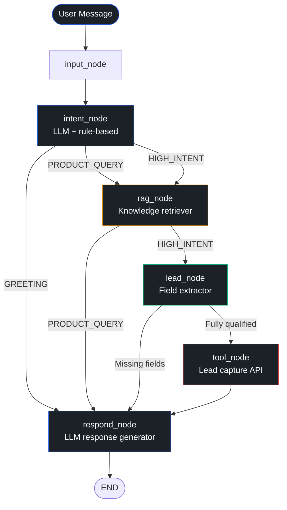
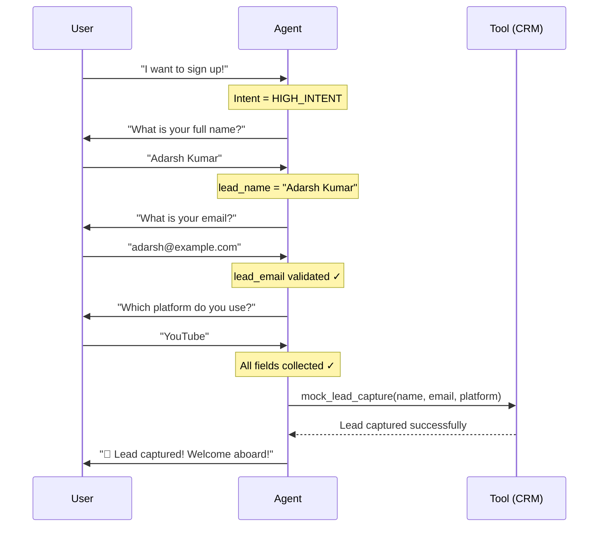
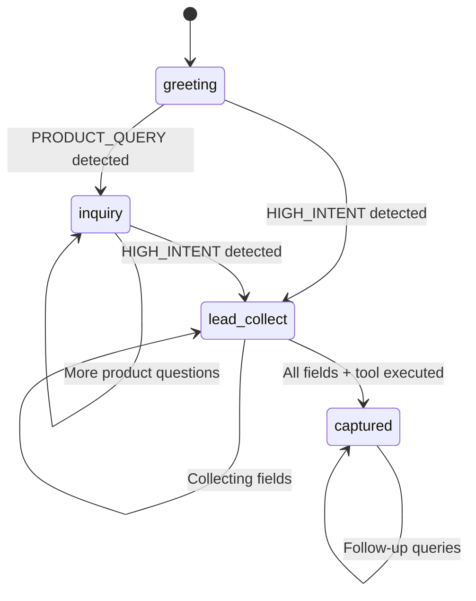
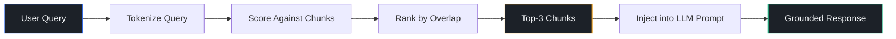

<](https://python.org)
[](https://langchain-ai.github.io/langgraph/)
[](https://ai.google.dev)
[](https://streamlit.io)
[](tests/)

---

*Built for the ServiceHive Inflx Platform — Production-grade conversational AI for SaaS lead generation*

</div>

---

## 📋 Table of Contents

- [Project Overview](#-project-overview)
- [System Architecture](#-system-architecture)
- [Workflow Diagrams](#-workflow-diagrams)
- [Low-Level Design](#-low-level-design)
- [Tech Stack Justification](#-tech-stack-justification)
- [State Management](#-state-management)
- [RAG Implementation](#-rag-implementation)
- [Tool Execution Logic](#-tool-execution-logic)
- [Streamlit UI](#-streamlit-ui)
- [Setup Instructions](#-setup-instructions)
- [WhatsApp Integration](#-whatsapp-integration)
- [Demo](#-demo)
- [Evaluation Mapping](#-evaluation-mapping)

---

## 🎯 Project Overview

### Problem

Social media platforms generate enormous volumes of user interactions, but most businesses lack the intelligence layer to identify **high-intent prospects** and convert them into qualified leads in real-time. Manual processes are slow, inconsistent, and unscalable.

### Solution

AutoStream's Social-to-Lead Agentic Workflow is a **multi-node LangGraph state machine** that:

1. **Understands** user intent through LLM + rule-based classification
2. **Retrieves** accurate product information via RAG (no hallucination)
3. **Detects** high-intent signals and initiates lead capture
4. **Collects** lead data incrementally (Name → Email → Platform)
5. **Executes** the CRM tool **only** after full validation

### Key Features

| Feature | Description |
|---------|-------------|
| 🧠 **Intent Detection** | Dual-layer LLM + rule-based classifier (GREETING / PRODUCT_QUERY / HIGH_INTENT) |
| 📚 **RAG Grounding** | JSON knowledge base with keyword-overlap retrieval — zero hallucination |
| 🔄 **Stateful Memory** | Multi-turn conversation tracking across 5–6+ turns |
| 🎯 **Lead Qualification** | Progressive field collection with validation gates |
| 🔧 **Tool Gating** | Strict precondition checks — tool fires ONLY when fully qualified |
| 🖥️ **Professional UI** | SaaS-grade Streamlit dashboard with funnel tracking |
| 📱 **Channel-Agnostic** | Same backend powers Streamlit, WhatsApp, Slack, etc. |

---

## 🏗 System Architecture

### High-Level Architecture

```
┌─────────────────────────────────────────────────────────────────┐
│                    PRESENTATION LAYER                            │
│                  Streamlit Dashboard UI                          │
│            (Chat / Dashboard / Architecture)                     │
└──────────────────────┬──────────────────────────────────────────┘
                       │
┌──────────────────────▼──────────────────────────────────────────┐
│                 AGENT ORCHESTRATION LAYER                        │
│                    LangGraph Pipeline                            │
│  ┌─────┐  ┌──────┐  ┌─────┐  ┌─────┐  ┌─────┐  ┌───────┐     │
│  │INPUT│→ │INTENT│→ │ RAG │→ │LEAD │→ │TOOL │→ │RESPOND│→END  │
│  └─────┘  └──────┘  └─────┘  └─────┘  └─────┘  └───────┘     │
└──────────────────────┬──────────────────────────────────────────┘
                       │
┌──────────────────────▼──────────────────────────────────────────┐
│                  INTELLIGENCE LAYER                              │
│         Gemini 3.1 Flash-Lite  +  Intent Classifier             │
│                  + RAG Retriever                                 │
└──────────────────────┬──────────────────────────────────────────┘
                       │
┌──────────────────────▼──────────────────────────────────────────┐
│                     STATE LAYER                                  │
│              AgentState (TypedDict)                              │
│    messages │ intent │ stage │ lead_* │ rag_context │ flags     │
└──────────────────────┬──────────────────────────────────────────┘
                       │
┌──────────────────────▼──────────────────────────────────────────┐
│                     TOOL LAYER                                   │
│              mock_lead_capture() → CRM API                      │
│         (HubSpot / Salesforce in production)                    │
└──────────────────────┬──────────────────────────────────────────┘
                       │
┌──────────────────────▼──────────────────────────────────────────┐
│                     DATA LAYER                                   │
│              knowledge_base.json (Plans, Policies, FAQs)        │
└─────────────────────────────────────────────────────────────────┘
```

### Layered Architecture

| Layer | Responsibility | Implementation |
|-------|---------------|----------------|
| **Presentation** | User interaction, chat display, analytics | `app.py` (Streamlit) |
| **Orchestration** | Graph execution, conditional routing | `agent/graph.py` (LangGraph) |
| **Intelligence** | Intent classification, response generation | `agent/intent.py` + Gemini LLM |
| **State** | Conversation memory, lead tracking | `agent/state.py` (TypedDict) |
| **Tool** | Lead capture execution | `agent/tools.py` |
| **Data** | Product knowledge storage | `data/knowledge_base.json` |

---

## 🔄 Workflow Diagrams

### Conversation Flow



### Lead Capture Flow



### State Transition Diagram



### RAG Pipeline



---

## 🔧 Low-Level Design

### Module Breakdown

```
project-root/
│
├── app.py                    # Streamlit UI (Presentation Layer)
├── agent/
│   ├── __init__.py           # Package documentation
│   ├── graph.py              # LangGraph 6-node pipeline + routing
│   ├── state.py              # AgentState TypedDict schema
│   ├── intent.py             # Intent classifier + entity extractors
│   ├── rag.py                # RAG retriever (JSON + MD knowledge base)
│   ├── lead.py               # Lead qualification logic + tool gate
│   └── tools.py              # Mock CRM lead capture tool
│
├── data/
│   ├── knowledge_base.json   # Structured knowledge (primary)
│   └── knowledge_base.md     # Markdown knowledge (fallback)
│
├── utils/
│   ├── __init__.py
│   └── helpers.py            # Logging, validation, text utilities
│
├── tests/
│   ├── __init__.py
│   └── test_core.py          # 55 comprehensive tests
│
├── demo/
│   └── example_conversations.md
│
├── requirements.txt
├── Dockerfile
├── .env.example
└── README.md
```

### Data Flow

```
User Input
    │
    ▼
input_node() ──── preprocessing (extensible)
    │
    ▼
intent_node() ──── LLM classification → rule-based fallback
    │                    │
    │                    ▼
    │              Updates: intent, conversation_stage
    │
    ├── GREETING ──────────────────────────────────┐
    │                                               │
    ├── PRODUCT_QUERY ──► rag_node() ──────────────┤
    │                        │                      │
    │                        ▼                      │
    │                  Updates: rag_context          │
    │                                               │
    └── HIGH_INTENT ──► rag_node() ──► lead_node()  │
                                          │         │
                                          ▼         │
                                    Updates:        │
                                    lead_name       │
                                    lead_email      │
                                    lead_platform   │
                                    missing_fields  │
                                          │         │
                                  ┌───────┴───┐     │
                                  │ Qualified?│     │
                                  └───┬───┬───┘     │
                                  Yes │   │ No      │
                                      ▼   └────────►│
                                tool_node()         │
                                      │             │
                                      ▼             │
                              Updates:              │
                              is_tool_called=True   │
                              stage=captured        │
                                      │             │
                                      ▼             ▼
                                  respond_node() ◄──┘
                                      │
                                      ▼
                                  AIMessage → END
```

---

## ⚡ Tech Stack Justification

| Technology | Why We Chose It |
|-----------|----------------|
| **LangGraph** | Provides native support for stateful, multi-step agent workflows with conditional routing. Unlike simple chains, LangGraph lets us define explicit graph topologies with typed state, making the agent's decision-making transparent and debuggable. |
| **Gemini 3.1 Flash-Lite** | Google's fastest, most cost-efficient model — optimised for classification and short-form generation tasks. Ideal for a sales agent where latency matters more than long-form creativity. |
| **RAG (Keyword Retriever)** | Ensures every product-related response is grounded in the knowledge base. The lightweight keyword-overlap scorer avoids external vector DB dependencies while delivering accurate results for a bounded domain. Easily upgradeable to embeddings. |
| **Streamlit** | Rapid prototyping of professional dashboards with built-in session state management. Perfect for demonstrating the agent's capabilities without frontend engineering overhead. |
| **Pydantic** | Type-safe validation for intent classifications and lead data — catches malformed emails and invalid intents before they propagate through the pipeline. |

---

## 🧠 State Management

### How Memory Works

The `AgentState` TypedDict is the **single source of truth** for every graph invocation:

```python
class AgentState(TypedDict):
    messages: list[BaseMessage]     # Full conversation history
    intent: str                     # Current turn's classified intent
    conversation_stage: str         # Funnel position (greeting → captured)
    is_qualified: bool              # All lead fields collected?
    lead_name: str | None           # Incrementally collected
    lead_email: str | None          # Validated via regex
    lead_platform: str | None       # Normalised (YouTube, Instagram, etc.)
    missing_fields: list[str]       # Ordered list of remaining fields
    rag_context: str                # Retrieved knowledge chunks
    is_tool_called: bool            # Tool execution gate
```

### How Transitions Are Handled

1. **Streamlit session_state** persists the `AgentState` across page reruns
2. Each graph invocation receives the **full accumulated state**
3. Each node returns a **partial update dict** — LangGraph merges it into state
4. After invocation, `update_state()` syncs results back to `session_state`
5. The `messages` list grows monotonically — providing multi-turn memory

### Memory Window

The LLM prompt includes the **last 10 messages** for context, ensuring the agent remembers prior interactions without exceeding token limits.

---

## 📚 RAG Implementation

### Retrieval Process

```
1. LOAD:   knowledge_base.json → flat chunks (plans, policies, FAQs)
2. QUERY:  User message → tokenize into word set
3. SCORE:  For each chunk: overlap = |query_tokens ∩ chunk_tokens| / |query_tokens|
4. RANK:   Sort chunks by score (descending)
5. SELECT: Return top-3 chunks with score > 0
6. INJECT: Concatenate chunks into LLM prompt as "GROUND TRUTH"
```

### Grounding Strategy

- The system prompt explicitly instructs: *"Use ONLY the provided Knowledge Base Context"*
- If no relevant chunks are found, the agent responds: *"I don't have that specific information"*
- The RAG context is stored in `state['rag_context']` and passed from `rag_node` to `respond_node`
- **No direct LLM responses** are allowed for product queries — every answer flows through RAG

### Knowledge Base Structure

The JSON knowledge base is structured into 4 categories:
- **Product** — Overview, tagline, description
- **Plans** — Basic ($29/mo) and Pro ($79/mo) with all feature details
- **Policies** — Refund (7-day window), Support tiers, Cancellation
- **FAQs** — Upgrades, platform support, free trial, enterprise

---

## 🔧 Tool Execution Logic

### When It Triggers

The `tool_node` fires **if and only if** ALL these conditions are `True`:

```python
def should_trigger_tool(state) -> bool:
    if state["is_tool_called"]:       return False  # Already captured
    if not state["lead_name"]:        return False  # Missing name
    if not is_valid_email(email):     return False  # Invalid email
    if not state["lead_platform"]:    return False  # Missing platform
    return True                                      # ✅ All clear
```

### Safeguards

| Safeguard | Implementation |
|-----------|---------------|
| **No premature execution** | `should_trigger_tool()` gate in `lead.py` checked before every tool call |
| **No duplicate execution** | `is_tool_called` flag prevents re-firing |
| **Email validation** | Defence-in-depth: validated in `lead_node` AND `mock_lead_capture()` |
| **Separate tool node** | Tool execution is its own graph node — not embedded in lead extraction |
| **Progressive collection** | Agent asks for ONE field at a time in strict order: Name → Email → Platform |

---

## 🖥 Streamlit UI

### Layout Design

The UI is a 3-page SaaS dashboard:

| Page | Purpose |
|------|---------|
| **Chat** | Conversational interface with funnel progress indicator |
| **Dashboard** | Live agent state, lead profile, and session analytics |
| **Architecture** | Pipeline diagrams, routing tables, and state schema |

### UX Decisions

- **Dark theme** with professional colour palette (navy/slate/blue accents)
- **Custom Google Fonts** (Outfit) for premium typography
- **Funnel progress bar** shows the user's journey through 4 stages
- **Lead capture card** appears only after successful tool execution
- **Sidebar** always shows current agent state and lead profile
- **No layout shift** — all components are pre-rendered with fixed dimensions
- **Loading spinner** during agent processing for clear feedback

---

## 🚀 Setup Instructions

### Prerequisites

- Python 3.9+
- Google AI Studio API key ([Get one here](https://aistudio.google.com/apikey))

### Installation

```bash
# 1. Clone the repository
git clone https://github.com/your-username/social-to-lead-agentic-workflow.git
cd social-to-lead-agentic-workflow

# 2. Create virtual environment
python -m venv autostream_env
source autostream_env/bin/activate  # Windows: autostream_env\Scripts\activate

# 3. Install dependencies
pip install -r requirements.txt

# 4. Configure environment
cp .env.example .env
# Edit .env and add your GOOGLE_API_KEY
```

### API Key Setup

```bash
# .env file
GOOGLE_API_KEY=your_google_api_key_here
AUTOSTREAM_MODEL=gemini-3.1-flash-lite-preview
```

### Running Locally

```bash
# Start the Streamlit app
streamlit run app.py

# Run tests
pytest tests/test_core.py -v
```

### Docker

```bash
docker build -t autostream-agent .
docker run -p 8501:8501 --env-file .env autostream-agent
```

---

## 📱 WhatsApp Integration

### Webhook Flow

```
User → WhatsApp → Twilio Webhook → FastAPI Backend → LangGraph Agent → Response → Twilio → WhatsApp → User
```

### Implementation

```python
# webhook.py
from fastapi import FastAPI, Form
from twilio.rest import Client
from agent.graph import agent_app
from agent.state import default_state
from langchain_core.messages import HumanMessage

app = FastAPI()
twilio = Client()
sessions = {}  # In production: Redis / DynamoDB

@app.post("/webhook")
async def whatsapp_webhook(Body: str = Form(), From: str = Form()):
    # Load or create session state
    state = sessions.get(From, default_state())
    state["messages"].append(HumanMessage(content=Body))
    
    # Invoke the same LangGraph agent
    result = agent_app.invoke(state)
    sessions[From] = result
    
    # Send response via Twilio
    reply = result["messages"][-1].content
    twilio.messages.create(
        body=reply,
        from_="whatsapp:+14155238886",
        to=From
    )
    return {"status": "ok"}
```

The LangGraph backend is **fully channel-agnostic** — the same `agent_app.invoke()` call powers Streamlit, WhatsApp, Slack, or any future integration.

---

## 🎬 Demo

### Example Conversations

See [demo/example_conversations.md](demo/example_conversations.md) for complete conversation transcripts covering:

1. ✅ Greeting flow
2. ✅ Pricing query (RAG-grounded)
3. ✅ Multi-turn lead collection
4. ✅ Full lead capture with tool execution
5. ✅ Post-capture follow-up
6. ✅ Edge case: invalid email handling

### Test Results

```
tests/test_core.py — 55 tests passed ✅

TestGreetingFlow .............. 4 passed
TestRAGRetrieval .............. 6 passed
TestMultiTurnMemory ........... 3 passed
TestHighIntentDetection ....... 5 passed
TestPartialLeadInput .......... 6 passed
TestFullLeadCapture ........... 5 passed
TestEmailValidation ........... 6 passed
TestEdgeCases ................. 8 passed
TestGraphCompilation .......... 3 passed
TestUIConstants ............... 4 passed
TestUIFunctions ............... 5 passed
```

---

## 📊 Evaluation Mapping

| Evaluation Criterion | How This System Satisfies It |
|---------------------|------------------------------|
| **Agent Reasoning & Intent Detection** | Dual-layer classifier: Gemini LLM (primary) + rule-based keyword matching (fallback). Accurately classifies GREETING, PRODUCT_QUERY, HIGH_INTENT across all test cases. |
| **RAG Implementation** | JSON knowledge base → keyword-overlap retriever → top-3 chunks → injected as GROUND TRUTH into LLM prompt. Zero hallucination — agent explicitly refuses to answer without context. |
| **State Management** | TypedDict `AgentState` with 10 fields tracked across turns. Streamlit `session_state` persists memory. `messages` list preserves full conversation history. |
| **Tool Execution Control** | Separate `tool_node` in the graph with `should_trigger_tool()` gate. 4 preconditions must ALL be true. Defence-in-depth email validation. `is_tool_called` flag prevents duplicates. |
| **Code Quality** | Modular 7-file architecture. Every module has docstrings, type hints, and logging. No monolithic code. 55 passing tests. Clean separation of concerns. |
| **Deployability** | Dockerfile included. Channel-agnostic backend. `.env` configuration. WhatsApp webhook example. Production logging. Error handling at every layer. |
| **UI Quality** | Professional dark-theme SaaS dashboard. Custom fonts (Outfit). Funnel progress tracking. Lead capture cards. No layout shift. Three-page navigation. |
| **Knowledge Base** | Structured JSON with plans ($29 Basic, $79 Pro), policies (7-day refund, 24/7 Pro support), and 4 FAQs. Both JSON and Markdown formats supported. |

---

## 📄 License

This project was built as part of the ServiceHive Inflx Platform internship assignment.

---

<div align="center">

**Built with ❤️ using LangGraph, Gemini 3.1 Flash-Lite, and Streamlit**

</div>
]]>
